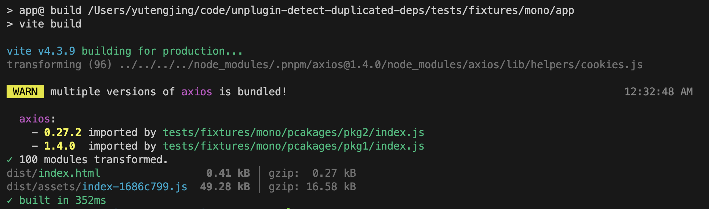

# unplugin-detect-duplicated-deps [](https://npmjs.com/package/unplugin)

[](https://github.com/tjx666/unplugin-detect-duplicated-deps/actions/workflows/unit-test.yml)

check the duplicated dependencies



## Installation

```bash
npm i -D unplugin-detect-duplicated-deps
```

```ts
// vite.config.ts
import UnpluginDetectDuplicatedDeps from 'unplugin-detect-duplicated-deps/vite';

export default defineConfig({
  plugins: [UnpluginDetectDuplicatedDeps()],
});
```

## License

[MIT](./LICENSE) License © 2023-PRESENT [YuTengjing](https://github.com/tjx666)
