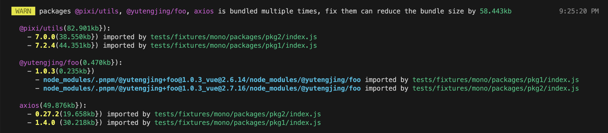

# unplugin-detect-duplicated-deps

[](https://npmjs.com/package/unplugin-detect-duplicated-deps) [](https://npmjs.com/package/unplugin-detect-duplicated-deps) [](https://github.com/tjx666/unplugin-detect-duplicated-deps/actions/workflows/unit-test.yml)

Detect duplicate packaged dependencies



## Installation

```bash
npm i -D unplugin-detect-duplicated-deps
```

## Usage

You can use the jsdoc to check option description and default value.

<details>
<summary>Vite</summary><br>

```ts
// vite.config.ts
import UnpluginDetectDuplicatedDeps from 'unplugin-detect-duplicated-deps/vite';

export default defineConfig({
  plugins: [UnpluginDetectDuplicatedDeps()],
});
```

<br>
</details>

<details>
<summary>Rollup</summary><br>

```ts
// rollup.config.js
import UnpluginDetectDuplicatedDeps from 'unplugin-detect-duplicated-deps/rollup';

export default {
  plugins: [UnpluginDetectDuplicatedDeps()],
};
```

<br>
</details>

<details>
<summary>Webpack</summary><br>

```ts
// webpack.config.mjs
import UnpluginDetectDuplicatedDeps from 'unplugin-detect-duplicated-deps/webpack';

const config = {
  plugins: [UnpluginDetectDuplicatedDeps()],
};
```

<br>
</details>

## Use as build checker

```ts
export default defineConfig({
  plugins: [
    UnpluginDetectDuplicatedDeps({
      // will exit build process if duplicated deps found
      throwErrorWhenDuplicated: true,
      // ignore specific duplicated deps
      ignore: {
        axios: ['0.27.2'],
        vue: ['*'],
      },
    }),
  ],
});
```

## Use in commonjs environment

Because [vite6 plan to deprecate commonjs node api](https://vitejs.dev/guide/troubleshooting.html#vite-cjs-node-api-deprecated), this plugin deprecate the commonjs support from 1.x. If you want use this plugin in commonjs environment, check [0.x](https://github.com/tjx666/unplugin-detect-duplicated-deps/tree/0.x)

## Thanks

- [duplicate-package-checker-webpack-plugin](https://github.com/darrenscerri/duplicate-package-checker-webpack-plugin)
- [unplugin](https://github.com/unjs/unplugin)
- [unplugin-starter](https://github.com/sxzz/unplugin-starter)
- [bundlephobia](https://bundlephobia.com/) provide the api to get package size
- [vercel](https://vercel.com/) host documentation

## Recommend Readings

- [Rsdoctor | Duplicate Dependency Problem](https://rsdoctor.dev/blog/topic/duplicate-pkg-problem)
- [Pnpm | How peers are resolved](https://pnpm.io/how-peers-are-resolved)
- [如何解决项目依赖重复打包问题](https://yutengjing.com/posts/%E5%A6%82%E4%BD%95%E8%A7%A3%E5%86%B3%E9%A1%B9%E7%9B%AE%E4%BE%9D%E8%B5%96%E9%87%8D%E5%A4%8D%E6%89%93%E5%8C%85%E9%97%AE%E9%A2%98/)

## License

[MIT](./LICENSE) License © 2023-PRESENT [YuTengjing](https://github.com/tjx666)
